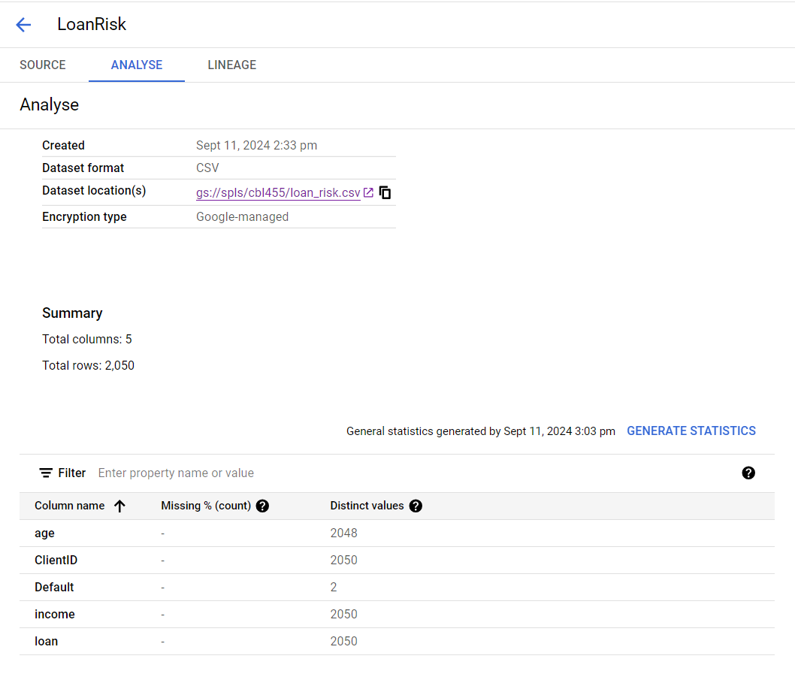

# Vertex AI: Predicting Loan Risk with AutoML

Using Vertex AI to train and serve a machine learning model to predict loan risk with a tabular dataset.

This project uses Vertex AI, the unified AI platform on Google Cloud to train and deploy a ML model. 

Vertex AI offers two options on one platform to build a ML model: 
1.  a codeless solution with AutoML 
2.  a code-based solution with Custom Training using Vertex Workbench. 

We will use AutoML in this project.

## Learning Objectives

1.  Uploading a dataset to Vertex AI.
2.  Training a machine learning model with AutoML.
3.  Model performance Evaluatation
4.  Deployment of the model to an endpoint.
5.  predictions.

# Solution 

## STEP 1 :  Prepare the training data

The csv file "loan_risk.csv" already upload on google cloud for learning purpose.

## STEP 2. Train your model